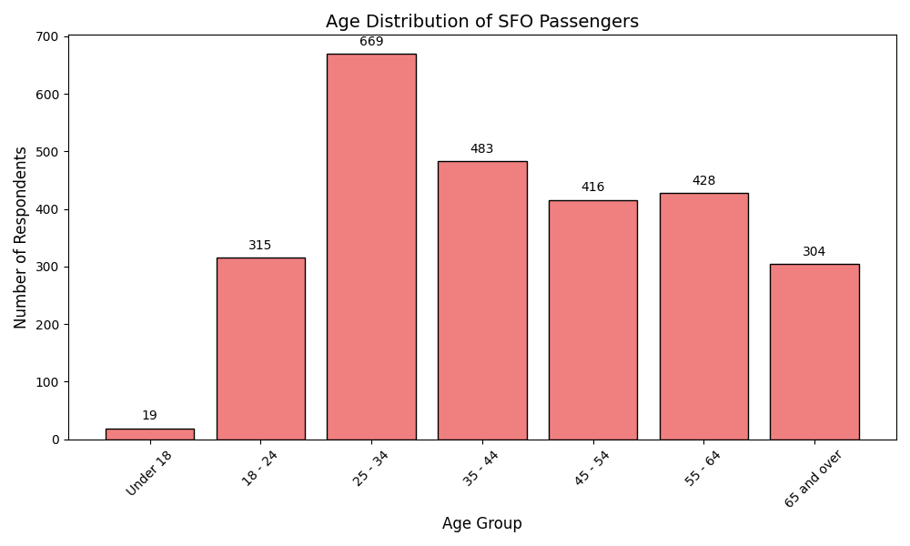
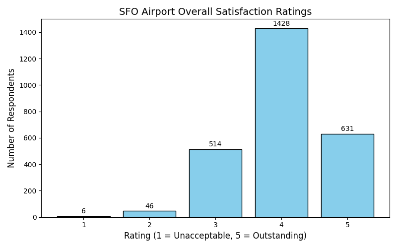
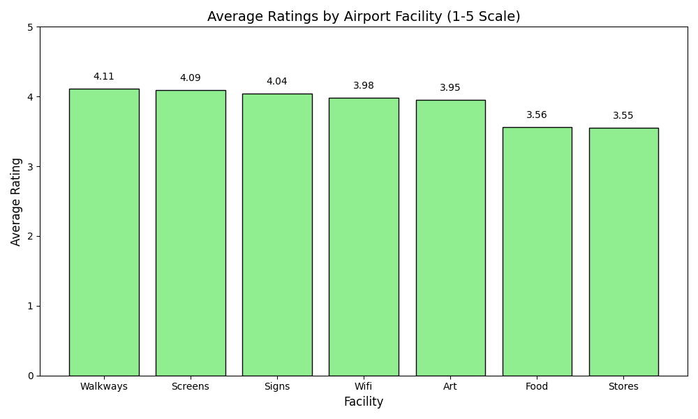

# SFO Airport Survey Analysis

This repository contains an analysis of the SFO Airport Survey dataset, which captures passenger feedback on various aspects of San Francisco International Airport (SFO).

## Data
The dataset includes passenger ratings for categories like art, food, stores, walkways, signs, airport overall, cleanliness, safety, and more. Wait times and demographics such as age and gender are also tracked. The main workbook used for this analysis is `SFO Airport Survey.twbx`, a Tableau workbook that includes the visualization setup and raw `.hyper` data extract.

## Demographics: Age Distribution

Understanding the demographic profile of respondents helps contextualize the ratings. Below is the age distribution of the surveyed passengers:

Based on the survey data, key demographic insights include:
- **Millennials and Gen Z Lead:** The largest groups of respondents fall within the 25-34 and 35-44 age ranges.
- **Broad Representation:** While younger adults are most prevalent, there is still significant representation among older demographics (45-64).

## Insights from SFO Ratings

### Overall Airport Satisfaction
Below is a chart visualizing the overall airport satisfaction ratings (`Q7ALL`) from passengers. The rating scale is from 1 to 5, where 1 means Unacceptable and 5 means Outstanding.

Based on the survey data, here are some key insights uncovered from the ratings distribution:
- **High Overall Satisfaction:** The average rating given by passengers is **4.00 out of 5**.
- **Vast Majority Approved:** Out of the 2,625 respondents who answered the overall rating question, a combined **78.44%** rated the airport either a 4 or 5.
- **Minimal Dissatisfaction:** Only a very small fraction of passengers (around 2%) gave a rating of 1 or 2, indicating that very few people had poor experiences regarding the overall airport.

### Ratings by Facility

Diving deeper into specific facilities, passengers were asked to rate elements like Walkways, Screens, Signs, Wifi, Art, Food, and Stores.

Based on the data:
- **Top Rated Facilities:** Navigational and informational elements excel. **Walkways (4.11)**, **Screens (4.09)**, and **Signs (4.04)** received the highest average ratings.
- **Areas for Improvement:** Amenities such as **Food (3.56)** and **Stores (3.55)** received the lowest average ratings compared to other facilities, signaling a potential area where the passenger experience could be enhanced.
